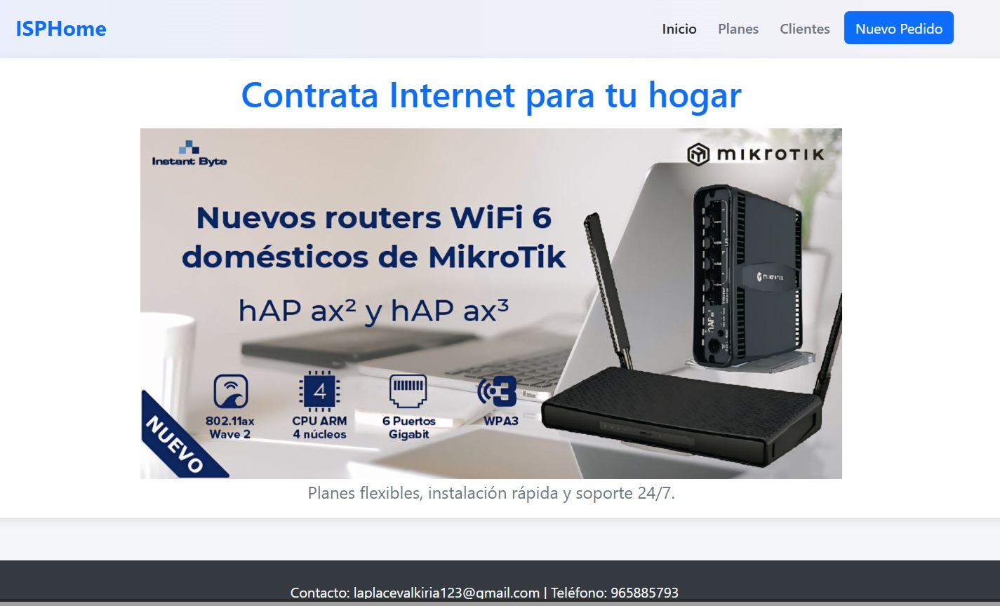
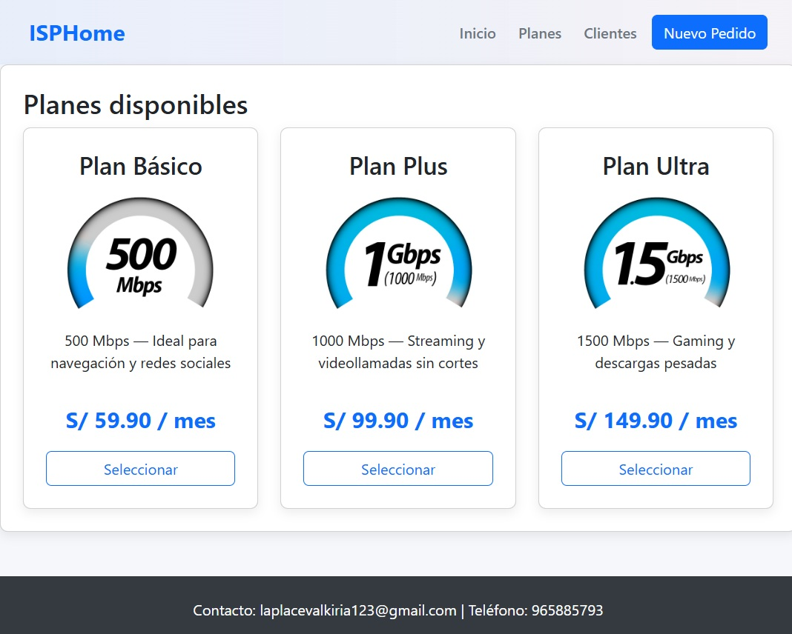

#  Venta de Internet Hogar — ISP SPA

Este proyecto es una aplicación web tipo **SPA (Single Page Application)** desarrollada con **HTML5, CSS3, Bootstrap 5 y JavaScript Vanilla**.  
Su propósito es simular el proceso de contratación de planes de internet, permitiendo registrar pedidos y gestionar clientes de manera sencilla.

---

##  Temática
El sistema representa la página de un **proveedor de servicios de internet (ISP)** que ofrece distintos planes para el hogar.  
Los usuarios pueden navegar entre las secciones, elegir un plan, registrar un pedido mediante un formulario validado y visualizar la lista de clientes con su respectivo estado.

---

##  Funcionalidades principales
- **Página responsiva** con diseño adaptable para dispositivos móviles.
- **Planes de internet** presentados en tarjetas con descripciones y precios.
- **Formulario de registro de pedidos** con validaciones en:
  - Nombre completo (mínimo 3 caracteres).
  - Correo electrónico.
  - Dirección.
  - Teléfono (9 dígitos).
  - DNI (8 dígitos).
- **Gestión de pedidos**:
  - Al enviar el formulario, el pedido se guarda en `localStorage`.
  - Se muestra en la sección de **Clientes** en una tabla dinámica.
  - Permite actualizar el **estado del pedido** (`Agendado`, `En Atención`, `Cancelado`).
- **SPA con JavaScript**: navegación sin recargar la página.
- **Bootstrap 5 + CSS personalizado** para el diseño.
- **Uso de Grid y Flexbox** en la maquetación.
- **Pie de página** con datos de contacto.

---

##  Tecnologías utilizadas
- **HTML5** (estructura semántica).
- **CSS3 / SASS** (variables, mixins, grid, flexbox, estilos responsivos).
- **Bootstrap 5** (framework frontend).
- **JavaScript Vanilla** (lógica de SPA, manejo de formulario y clientes).
- **LocalStorage** (persistencia de pedidos en el navegador).

---

##  Integrantes
- Ayala Arce Sergio Daniel  
- Mayhualla Loayza Cristian Jesús  

---

##  Vista previa

---

##  Licencia
Este proyecto es de uso académico y está disponible bajo la licencia MIT.
